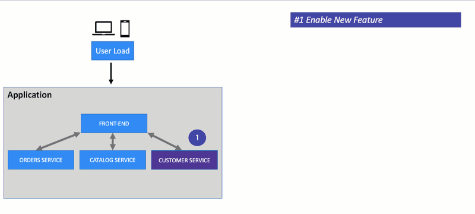

# Overview

This repo has the script used to setup the [xMatters Demo Dayz](https://www.xmatters.com/demo-dayz) event where we showed how a great customer experience requires more than development of a useful new feature — it’s imperative that features be available 24/7 without interruption. 

# Demo Dayz session on YouTube

[YouTube Page](https://www.youtube.com/watch?v=eHDO4ss8B8A&t=1118As)

# Setup steps

There a few subfolders that contain scripts and file.  The order to setup and use them is as follows:

1. [Setup sample application](./app/README.md)

    See this [Overview](https://github.com/dt-orders/overview) for details on the sample application.

1. [Dynatrace setup using monaco](./monaco/README.md)

1. [Keptn setup](./keptn/README.md)

# Scripts folder

The scripts subfolder has scripts that are used as part of the sample application and keptn setup.  

